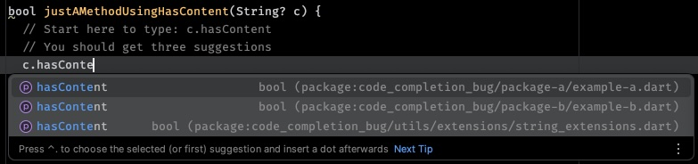

## Reproduction steps

1. Open this project using Android Studio.
2. Open `lib/package-c/example-c.dart`.
3. Within the method just start typing `c.hasContent` and observe the auto complete suggestions:

The auto complete shows too much completion suggestions.
There should only be the last one.
The other two suggestions are just files _importing_ the extensions as well, but not (re-) exporting them.
If you create more files importing the extensions the more suggestions you will get.

## Used versions

* Android Studio Koala Feature Drop | 2024.1.2 Patch 1 (Build #AI-241.19072.14.2412.12360217)
* Dart: 3.5.2
* Dart Plugin Version: 241.18968.26
